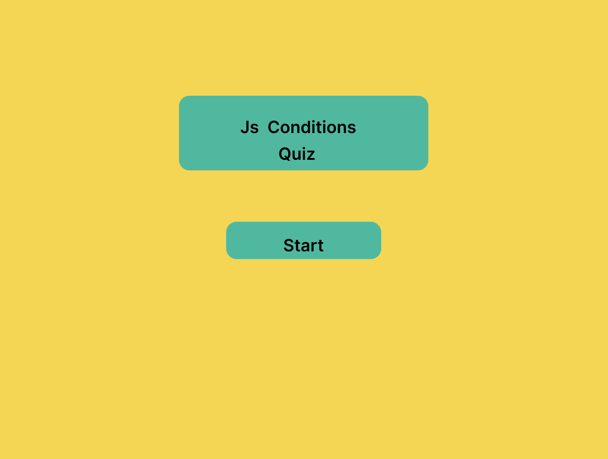

# JS Functions Quiz

[game link](https://640dab36f99e4b5b937019bd--adorable-cendol-ce3b37.netlify.app/)
This quiz program, built with Ionic Framework and React, tests the user's knowledge of JavaScript Conditions.

## Features

### Home Screen

- The header should display the title **"JS Conditions Quiz"**.
- The **start** button should be centred on the screen and prominently displayed.

### Question Screen

- The header should display the title **"Question X of 10"**.
- A progress bar should be displayed at the top of the screen to show the user's progress.
- The question should be displayed prominently in the centre of the screen.
- The three answer options should be displayed below the question.
- The user should be able to select one of the three answer options by tapping on it.
- A button should be added at the bottom right of the screen to allow the user to proceed to the next question.

### Result Screen

- The header should display the title **"Quiz Results"**.
- A summary of the user's score should be displayed.
The screen should display a theme based on whether the user passed or failed the quiz.
- A "Try Again" button should be prominently displayed in the centre of  the screen.

.png)
.png)
